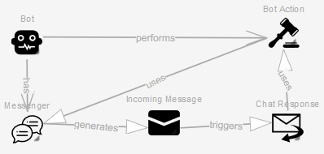

# Social-Bot-Framework


Core Components
--------
* [las2peer-Social-Bot-Manager-Service](https://github.com/rwth-acis/las2peer-Social-Bot-Manager-Service)

External Dependencies
--------
* [y-websockets-server](https://github.com/y-js/y-websockets-server)
* [SyncMeta](https://github.com/rwth-acis/syncmeta)
* [MobSOS Data-Processing](https://github.com/rwth-acis/mobsos-data-processing)
* [MobSOS Success-Modeling](https://github.com/rwth-acis/mobsos-success-modeling)
* [Rasa](https://github.com/RasaHQ/rasa.git)

Backend Integration
--------
### Trigger
For the bot to be triggered, the service must send an appropriate [monitoring message](https://github.com/rwth-acis/mobsos-data-processing/wiki/Manual#2-monitor-a-service).
```json
{
    "serviceAlias": "",
    "functionName": "",
    "attributes":{}
}
```
The `serviceAlias` attribute should contain the alias given by the @ServicePath annotation. 
The `functionName`attribute should contain the name of the function. 
Any type of attributes (@PathParam/@QueryParam/@BodyParam) should be listed in the `attributes` attribute.
If the service uses [PoJo's](https://en.wikipedia.org/wiki/Plain_old_Java_object) the developer can make use of the [Gson library](https://github.com/google/gson). 


# SBF Utilities Frontend

This application provides helpers to interact with the Social Bot Manager service.

This frontend consists of the Bot Modeling and the NLU Model Training Helper. 

## Build and Run the Frontend
First build the Docker image
```
$ docker build -t rwthacis/sbf-utils .
```

Then you can start the container like this:
```
$ docker run -p 8070:8070 -e WEBHOST=<host_address> -e YJS=<yjs_address> -e OIDC_CLIENT_ID=<oidc_client_id> -e RASA_NLU=<rasa_server> -e SBF_MANAGER=<sbfmanager_address> -d rwthacis/sbf-utils
```
After container started to run, application will be accessible via http://127.0.0.1:8070

Application is using [YJS][yjs-github] for interwidget communication, therefore it needs [y-websocket-server][y-websocket-server] instance. 
It can be started with following command:
```
docker run -p 1234:1234  -d rwthacis/y-websockets-server
```
Then, address of y-websockets-server instance need to be passed to Docker container during initialization with `YJS` environment variable. If websocket server is started with previous command, its address will be `127.0.0.1:1234` and this value need to be passed to Docker container during initialization.


Following environment variables are needed to be passed to container during initialization:

* `WEBHOST`: Url address of application
* `YJS`: Root url address of Yjs websocket server. If it is running behind reverse proxy, relative path need to be provided with the `YJS_RESOURCE_PATH` env variable.
* `OIDC_CLIENT_ID`: OIDC client id which is used for authentication purpose. Client id can be acquired from Learning Layers after client registration

Following environment variables have default values however they can be changed during initialization:

* `PORT`: Port which Nginx server is listening locally. This port need to be made accessible to outside with port mapping during initialization. Default value is `8070`.
* `YJS_RESOURCE_PATH`: Resource path of Yjs websocker server. If websocket server running behind reverse proxy and `/yjs` path is redirected to websocket server, this env variable need to be `/yjs/socket.io`. Default value is `/socket.io`.
* `SBF_MANAGER`: Address of a running SBFManager Instance. If not empty, the given address will be written in the "SBFManager Endpoint" fields of the frontend.
* `RASA_NLU`: Address of a server hosting the NLU Model. If not empty, the given address will be written in the "Rasa NLU Endpoint" field of the NLU Model Training Helper.

[yjs-github]: https://github.com/yjs/yjs
[y-websocket-server]: https://github.com/y-js/y-websockets-server

# Deploying a Bot
After creating a bot model on the frontend, you will be able to upload the bot to the SBFManager by using the "Model Uploader" on the "Bot Modeling" page. For this to work, you will need a running instance of the [SBFManager](https://github.com/rwth-acis/las2peer-Social-Bot-Manager-Service) and adjust the "SBFManager Endpoint" accordingly. 

When creating chatbots you will also need to provide a [Rasa server](https://github.com/RasaHQ/rasa.git) hosting a NLU Model. You can also use the "NLU Model Training Helper" to create your own NLU Model and upload that model by adjusting the "SBFManager Endpoint" and "Rasa NLU Endpoint" accordingly.

# Bot-modeling Guide

### Create communication state with service
There is the possiblity to let users communicate and send messages to a specific triggered service for a certain period of time, depending on the service.
During this communication state the service will receive every user message and also have the possibility to communicate with the user. 
To model this you need to do the following:
- Have an incoming message object trigger a chat response object
- The chat response object will contain no message 
- The chat response object will be connect to a bot action object with the "uses" relation
- The bot action will now be the service with which the user will communicate



The service will need to respond to the request with a json file containing the following data: 
```json
{
    "text": "",
    "closeContext": ""
}
```
The `text` attribute represents the service's response to the user.

The `closeContext` attribute is a boolean value which informs the Social Bot Manager if the communication state is to be maintained or stopped. (Note that, if no closeContext attribute is found, the communication state will automatically be stopped.)

